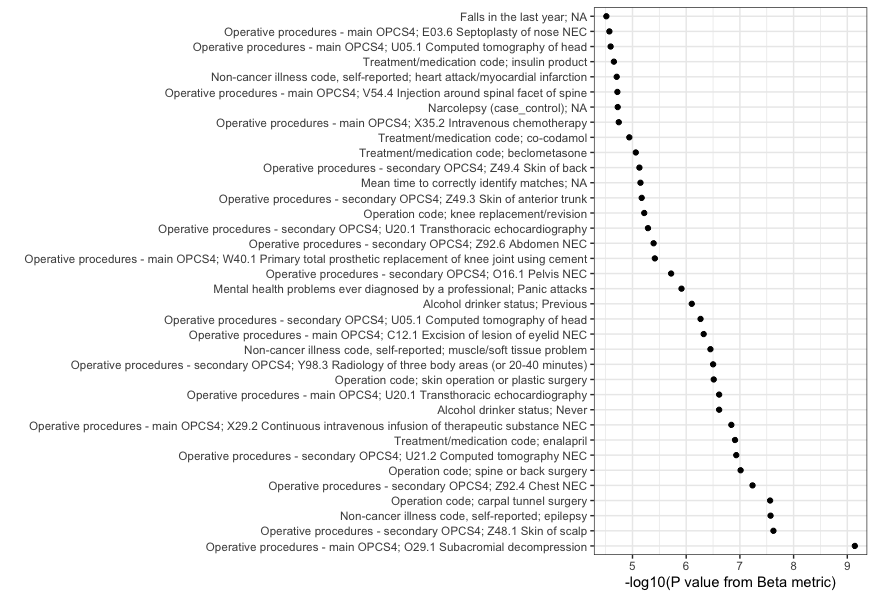

<!-- README.md is generated from README.Rmd. Please edit that file -->

# ukbFGSEA

<!-- badges: start -->
<!-- badges: end -->

## Overview

The goal of ukbFGSEA is to apply gene set enrichment analysis, based on
FGSEA package, to Genebass data released by Karczewski et al. The
package is amed to help researchers to perform detailed evaluations of
gene set enrichment across a wide range of phenotypes. The package
mainly includes three functions:

- `ukbfgsea()` applies `fgsea::fgseaMultilevel()` - an adaptive
  multilevel splitting Monte Carlo approach, to a single phenotype in
  the UK Biobank Genebass dataset for a specified input gene set.

- `map_ukbfgsea()` applies `fgsea::fgseaMultilevel()` to multiple
  phenotypes in the UK Biobank Genebass dataset for a specified input
  gene set. This function is suitable for large-scale(or full) Genebass
  dataset.

- `tidy_map()` organizes the raw output of `map_ukbfgsea()` to a tibble
  including distinct columns for each phenotype and each ranking method,
  providing a clear and accessible summary of the FGSEA results.

## Installation

You can install the development version of ukbFGSEA like so:

``` r
# install.packages("devtools")
library(devtools)
install_github("ctlab/fgsea")
install_github("AzuleneG/ukbFGSEA")
```

`genebass_test_data` is a test data originated from `results.mt`
provided on the Genebass website. The package implements it as a test
data set for testing the functions. We includes the documentation of
this dataset, but because this test data is very large (220.6MB), the
file is only provided in the releases of repo `AzuleneG/ukbFGSEA`. You
can install the data like so:

DO NOT install `piggyback` from CRAN to avoid a possible bug. Use
`install_github()` instead.

``` r
install_github("ropensci/piggyback")
library(piggyback)

piggyback::pb_download("genebass_test_data.rda",
    repo = "AzuleneG/ukbFGSEA",
    dest = tempdir())
load(paste0(tempdir(), "/genebass_test_data.rda"))
```

## Example

This example shows how to use `map_ukbfgsea()` to apply FGSEA on
Genebass data, using the test data attached in the package.

``` r
library(tidyverse)
library(ukbFGSEA)

genebass_test_data 

genebass_test_data %>% 
  count(trait_type, phenocode, description, description_more)

# then apply ukbfgsea to three phenotypes for each of gene set
set.seed(123)
asd_output <- map_ukbfgsea(input_geneset = ASD185, multiple_phenotypes = genebass_test_data)

asd_output_tidy <- tidy_map(asd_output)
asd_output_tidy
```

## Tutorial

### Introduction

Welcome to the `ukbFGSEA` tutorial. This package is designed for
performing fast pre-ranked gene set enrichment analysis (FGSEA)
specifically tailored for the UK Biobank Genebass dataset. This tutorial
aims to guide you through the effective use of the package, employing
practical examples using gene sets related to Autism Spectrum Disorder
(ASD), Developmental Delay (DD), and Neurodevelopmental Disorders (NDD).

### Practical Examples

#### Example 1: Quick Test Run

Since the Genebass data, including 4,529 phenotypes, is very large,
running ukbFGSEA on all of them can take quite many hours. To illustrate
how to run ukbFGSEA, we will use three phenotypes from Genebass as an
example for a quick test run. Later, we will describe how to read in
data, including all phenotypes from Genebass and apply ukbFGSEA to them.

``` r
# First, load the libraries, Genebass Test Data, ASD Gene Set, DD Gene Set and NDD Gene Set
library(tidyverse)
#> ── Attaching core tidyverse packages ──────────────────────── tidyverse 2.0.0 ──
#> ✔ dplyr     1.1.4     ✔ readr     2.1.5
#> ✔ forcats   1.0.0     ✔ stringr   1.5.1
#> ✔ ggplot2   3.5.1     ✔ tibble    3.2.1
#> ✔ lubridate 1.9.3     ✔ tidyr     1.3.1
#> ✔ purrr     1.0.2     
#> ── Conflicts ────────────────────────────────────────── tidyverse_conflicts() ──
#> ✖ dplyr::filter() masks stats::filter()
#> ✖ dplyr::lag()    masks stats::lag()
#> ℹ Use the conflicted package (<http://conflicted.r-lib.org/>) to force all conflicts to become errors
library(ukbFGSEA)
library(piggyback) #Only for test data

# Download and load test data

pb_download("genebass_test_data.rda",
    repo = "AzuleneG/ukbFGSEA",
    dest = tempdir())
load(paste0(tempdir(), "/genebass_test_data.rda"))

# Display the structure of the test data
genebass_test_data %>%
  count(annotation,
        trait_type,
        phenocode,
        description,
        description_more)
#> # A tibble: 12 × 6
#>    annotation       trait_type  phenocode description     description_more     n
#>    <chr>            <chr>           <dbl> <chr>           <chr>            <int>
#>  1 missense|LC      categorical      6150 Vascular/heart… "ACE touchscree… 19052
#>  2 missense|LC      continuous      22200 Year of birth   "Year of birth … 19389
#>  3 missense|LC      continuous      30760 HDL cholesterol "Measured by en… 19304
#>  4 pLoF             categorical      6150 Vascular/heart… "ACE touchscree… 18027
#>  5 pLoF             continuous      22200 Year of birth   "Year of birth … 17579
#>  6 pLoF             continuous      30760 HDL cholesterol "Measured by en… 18220
#>  7 pLoF|missense|LC categorical      6150 Vascular/heart… "ACE touchscree… 18281
#>  8 pLoF|missense|LC continuous      22200 Year of birth   "Year of birth … 18611
#>  9 pLoF|missense|LC continuous      30760 HDL cholesterol "Measured by en… 18530
#> 10 synonymous       categorical      6150 Vascular/heart… "ACE touchscree… 19023
#> 11 synonymous       continuous      22200 Year of birth   "Year of birth … 19342
#> 12 synonymous       continuous      30760 HDL cholesterol "Measured by en… 19272

# Apply ukbfgsea to three phenotypes for each gene set
set.seed(123)
asd_test_output <- map_ukbfgsea(input_geneset = ASD185, multiple_phenotypes = genebass_test_data)
#> Warning: There were 24 warnings in `dplyr::mutate()`.
#> The first warning was:
#> ℹ In argument: `output = purrr::map(data, ~ukbfgsea(input_geneset =
#>   input_geneset, ukb_genebass = .x))`.
#> ℹ In group 1: `n_cases = 9308`, `n_controls = 384687`, `heritability =
#>   0.060414`, `saige_version = "SAIGE_0.44.5"`, `inv_normalized = FALSE`,
#>   `trait_type = "categorical"`, `phenocode = 6150`, `pheno_sex = "both_sexes"`,
#>   `coding = 1`, `modifier = NA`, `n_cases_defined = 11263`, `n_cases_both_sexes
#>   = 11608`, `n_cases_females = 2217`, `n_cases_males = 9046`, `description =
#>   "Vascular/heart problems diagnosed by doctor"`, `description_more = "ACE
#>   touchscreen question \"Has a doctor ever told you that you have had any of
#>   the following conditions? (You can select more than one answer)\" The
#>   following checks were performed: If code -7 was selected, then no additional
#>   choices were allowed.  If code -3 was selected, then no additional choices
#>   were allowed.  If the participant activated the Help button they were shown
#>   the message: If you do not know if you have had any of the listed conditions,
#>   enter None of the above. You can check this with an interviewer later in the
#>   visit."`, `coding_description = "Heart attack"`, `category = "UK Biobank
#>   Assessment Centre > Touchscreen > Health and medical history > Medical
#>   conditions"`, `annotation = "missense|LC"`.
#> Caused by warning in `preparePathwaysAndStats()`:
#> ! There are ties in the preranked stats (0.22% of the list).
#> The order of those tied genes will be arbitrary, which may produce unexpected results.
#> ℹ Run `dplyr::last_dplyr_warnings()` to see the 23 remaining warnings.
asd_test_output_tidy <- tidy_map(asd_test_output)
asd_test_output_tidy
#> # A tibble: 12 × 33
#>    annotation       n_cases n_controls heritability saige_version inv_normalized
#>    <chr>              <dbl>      <dbl>        <dbl> <chr>         <lgl>         
#>  1 missense|LC         9308     384687       0.0604 SAIGE_0.44.5  FALSE         
#>  2 pLoF                9308     384687       0.0604 SAIGE_0.44.5  FALSE         
#>  3 synonymous          9308     384687       0.0604 SAIGE_0.44.5  FALSE         
#>  4 pLoF|missense|LC    9308     384687       0.0604 SAIGE_0.44.5  FALSE         
#>  5 missense|LC        99877         NA       0      SAIGE_0.44.5  FALSE         
#>  6 pLoF               99877         NA       0      SAIGE_0.44.5  FALSE         
#>  7 synonymous         99877         NA       0      SAIGE_0.44.5  FALSE         
#>  8 pLoF|missense|LC   99877         NA       0      SAIGE_0.44.5  FALSE         
#>  9 missense|LC       344938         NA       0      SAIGE_0.44.5  FALSE         
#> 10 pLoF              344938         NA       0      SAIGE_0.44.5  FALSE         
#> 11 synonymous        344938         NA       0      SAIGE_0.44.5  FALSE         
#> 12 pLoF|missense|LC  344938         NA       0      SAIGE_0.44.5  FALSE         
#> # ℹ 27 more variables: trait_type <chr>, phenocode <dbl>, pheno_sex <chr>,
#> #   coding <dbl>, modifier <chr>, n_cases_defined <dbl>,
#> #   n_cases_both_sexes <dbl>, n_cases_females <dbl>, n_cases_males <dbl>,
#> #   description <chr>, description_more <chr>, coding_description <chr>,
#> #   category <chr>, beta_pval <dbl>, beta_padj <dbl>, beta_log2err <dbl>,
#> #   beta_ES <dbl>, beta_NES <dbl>, beta_size <int>, beta_leadingEdge <list>,
#> #   sign_pval <dbl>, sign_padj <dbl>, sign_log2err <dbl>, sign_ES <dbl>, …

set.seed(123)
dd_test_output <- map_ukbfgsea(input_geneset = DD477, multiple_phenotypes = genebass_test_data)
#> Warning: There were 24 warnings in `dplyr::mutate()`.
#> The first warning was:
#> ℹ In argument: `output = purrr::map(data, ~ukbfgsea(input_geneset =
#>   input_geneset, ukb_genebass = .x))`.
#> ℹ In group 1: `n_cases = 9308`, `n_controls = 384687`, `heritability =
#>   0.060414`, `saige_version = "SAIGE_0.44.5"`, `inv_normalized = FALSE`,
#>   `trait_type = "categorical"`, `phenocode = 6150`, `pheno_sex = "both_sexes"`,
#>   `coding = 1`, `modifier = NA`, `n_cases_defined = 11263`, `n_cases_both_sexes
#>   = 11608`, `n_cases_females = 2217`, `n_cases_males = 9046`, `description =
#>   "Vascular/heart problems diagnosed by doctor"`, `description_more = "ACE
#>   touchscreen question \"Has a doctor ever told you that you have had any of
#>   the following conditions? (You can select more than one answer)\" The
#>   following checks were performed: If code -7 was selected, then no additional
#>   choices were allowed.  If code -3 was selected, then no additional choices
#>   were allowed.  If the participant activated the Help button they were shown
#>   the message: If you do not know if you have had any of the listed conditions,
#>   enter None of the above. You can check this with an interviewer later in the
#>   visit."`, `coding_description = "Heart attack"`, `category = "UK Biobank
#>   Assessment Centre > Touchscreen > Health and medical history > Medical
#>   conditions"`, `annotation = "missense|LC"`.
#> Caused by warning in `preparePathwaysAndStats()`:
#> ! There are ties in the preranked stats (0.22% of the list).
#> The order of those tied genes will be arbitrary, which may produce unexpected results.
#> ℹ Run `dplyr::last_dplyr_warnings()` to see the 23 remaining warnings.
dd_test_output_tidy <- tidy_map(dd_test_output)
dd_test_output_tidy
#> # A tibble: 12 × 33
#>    annotation       n_cases n_controls heritability saige_version inv_normalized
#>    <chr>              <dbl>      <dbl>        <dbl> <chr>         <lgl>         
#>  1 missense|LC         9308     384687       0.0604 SAIGE_0.44.5  FALSE         
#>  2 pLoF                9308     384687       0.0604 SAIGE_0.44.5  FALSE         
#>  3 synonymous          9308     384687       0.0604 SAIGE_0.44.5  FALSE         
#>  4 pLoF|missense|LC    9308     384687       0.0604 SAIGE_0.44.5  FALSE         
#>  5 missense|LC        99877         NA       0      SAIGE_0.44.5  FALSE         
#>  6 pLoF               99877         NA       0      SAIGE_0.44.5  FALSE         
#>  7 synonymous         99877         NA       0      SAIGE_0.44.5  FALSE         
#>  8 pLoF|missense|LC   99877         NA       0      SAIGE_0.44.5  FALSE         
#>  9 missense|LC       344938         NA       0      SAIGE_0.44.5  FALSE         
#> 10 pLoF              344938         NA       0      SAIGE_0.44.5  FALSE         
#> 11 synonymous        344938         NA       0      SAIGE_0.44.5  FALSE         
#> 12 pLoF|missense|LC  344938         NA       0      SAIGE_0.44.5  FALSE         
#> # ℹ 27 more variables: trait_type <chr>, phenocode <dbl>, pheno_sex <chr>,
#> #   coding <dbl>, modifier <chr>, n_cases_defined <dbl>,
#> #   n_cases_both_sexes <dbl>, n_cases_females <dbl>, n_cases_males <dbl>,
#> #   description <chr>, description_more <chr>, coding_description <chr>,
#> #   category <chr>, beta_pval <dbl>, beta_padj <dbl>, beta_log2err <dbl>,
#> #   beta_ES <dbl>, beta_NES <dbl>, beta_size <int>, beta_leadingEdge <list>,
#> #   sign_pval <dbl>, sign_padj <dbl>, sign_log2err <dbl>, sign_ES <dbl>, …

set.seed(123)
ndd_test_output <- map_ukbfgsea(input_geneset = NDD664, multiple_phenotypes = genebass_test_data)
#> Warning: There were 24 warnings in `dplyr::mutate()`.
#> The first warning was:
#> ℹ In argument: `output = purrr::map(data, ~ukbfgsea(input_geneset =
#>   input_geneset, ukb_genebass = .x))`.
#> ℹ In group 1: `n_cases = 9308`, `n_controls = 384687`, `heritability =
#>   0.060414`, `saige_version = "SAIGE_0.44.5"`, `inv_normalized = FALSE`,
#>   `trait_type = "categorical"`, `phenocode = 6150`, `pheno_sex = "both_sexes"`,
#>   `coding = 1`, `modifier = NA`, `n_cases_defined = 11263`, `n_cases_both_sexes
#>   = 11608`, `n_cases_females = 2217`, `n_cases_males = 9046`, `description =
#>   "Vascular/heart problems diagnosed by doctor"`, `description_more = "ACE
#>   touchscreen question \"Has a doctor ever told you that you have had any of
#>   the following conditions? (You can select more than one answer)\" The
#>   following checks were performed: If code -7 was selected, then no additional
#>   choices were allowed.  If code -3 was selected, then no additional choices
#>   were allowed.  If the participant activated the Help button they were shown
#>   the message: If you do not know if you have had any of the listed conditions,
#>   enter None of the above. You can check this with an interviewer later in the
#>   visit."`, `coding_description = "Heart attack"`, `category = "UK Biobank
#>   Assessment Centre > Touchscreen > Health and medical history > Medical
#>   conditions"`, `annotation = "missense|LC"`.
#> Caused by warning in `preparePathwaysAndStats()`:
#> ! There are ties in the preranked stats (0.22% of the list).
#> The order of those tied genes will be arbitrary, which may produce unexpected results.
#> ℹ Run `dplyr::last_dplyr_warnings()` to see the 23 remaining warnings.
ndd_test_output_tidy <- tidy_map(ndd_test_output)
ndd_test_output_tidy
#> # A tibble: 12 × 33
#>    annotation       n_cases n_controls heritability saige_version inv_normalized
#>    <chr>              <dbl>      <dbl>        <dbl> <chr>         <lgl>         
#>  1 missense|LC         9308     384687       0.0604 SAIGE_0.44.5  FALSE         
#>  2 pLoF                9308     384687       0.0604 SAIGE_0.44.5  FALSE         
#>  3 synonymous          9308     384687       0.0604 SAIGE_0.44.5  FALSE         
#>  4 pLoF|missense|LC    9308     384687       0.0604 SAIGE_0.44.5  FALSE         
#>  5 missense|LC        99877         NA       0      SAIGE_0.44.5  FALSE         
#>  6 pLoF               99877         NA       0      SAIGE_0.44.5  FALSE         
#>  7 synonymous         99877         NA       0      SAIGE_0.44.5  FALSE         
#>  8 pLoF|missense|LC   99877         NA       0      SAIGE_0.44.5  FALSE         
#>  9 missense|LC       344938         NA       0      SAIGE_0.44.5  FALSE         
#> 10 pLoF              344938         NA       0      SAIGE_0.44.5  FALSE         
#> 11 synonymous        344938         NA       0      SAIGE_0.44.5  FALSE         
#> 12 pLoF|missense|LC  344938         NA       0      SAIGE_0.44.5  FALSE         
#> # ℹ 27 more variables: trait_type <chr>, phenocode <dbl>, pheno_sex <chr>,
#> #   coding <dbl>, modifier <chr>, n_cases_defined <dbl>,
#> #   n_cases_both_sexes <dbl>, n_cases_females <dbl>, n_cases_males <dbl>,
#> #   description <chr>, description_more <chr>, coding_description <chr>,
#> #   category <chr>, beta_pval <dbl>, beta_padj <dbl>, beta_log2err <dbl>,
#> #   beta_ES <dbl>, beta_NES <dbl>, beta_size <int>, beta_leadingEdge <list>,
#> #   sign_pval <dbl>, sign_padj <dbl>, sign_log2err <dbl>, sign_ES <dbl>, …
```

#### Example 2: Applying ukbFGSEA on Genebass Data Including All Phenotypes

If you’d like to run ukbFGSEA on all phenotypes in the UK Biobank, first
download the entire Genebass dataset from [Google
Drive](https://drive.google.com/file/d/1j0bAXm2AYmZNQxQBbFODien0dpKUGCHn/view?usp=drive_link).
Reading in the data may take several hours due to its large size. The
runtime of ukbFGSEA depends on the number of phenotypes provided to the
map_ukbfgsea function. Therefore, we suggest filtering out phenotypes
that are not relevant to your interests and those with small sample
sizes in the UK Biobank, as they lack power in burden tests. Generally,
we recommend filtering out phenotypes with case sample sizes \< 3000 and
those with descriptions starting with “Date”. You are welcome to apply
your own filtering criteria to clean the phenotypes.

In the following code example, we apply our recommended filters and
focus on the burden test results of pLoF (protein-truncating) variants.
Since it may take many hours to run ukbFGSEA on thousands of phenotypes,
we provide the tidy output of map_ukbfgsea on filtered phenotypes in our
package for users as an example. Users can simply load the data
`asd_all_output_tidy`, `dd_all_output_tidy`, and `ndd_all_output_tidy`.

``` r
library(tidyverse)
library(ukbFGSEA)

all_phenotypes <- readRDS(file = "/the/path/to/genebass_all_phenotypes.rds")

phenotypes_filtered <- all_phenotypes %>%
  filter(n_cases >= 3000) %>%
  filter(!str_detect(description, "^Date ")) %>%
  filter(annotation == "pLoF")

set.seed(123)
asd_all_output <- map_ukbfgsea(input_geneset = ASD185, multiple_phenotypes = phenotypes_filtered)
asd_all_output_tidy <- tidy_map(asd_all_output)
asd_all_output_tidy

set.seed(123)
dd_all_output <- map_ukbfgsea(input_geneset = DD477, multiple_phenotypes = phenotypes_filtered)
dd_all_output_tidy <- tidy_map(dd_all_output)
dd_all_output_tidy

set.seed(123)
ndd_all_output <- map_ukbfgsea(input_geneset = NDD664, multiple_phenotypes = phenotypes_filtered)
ndd_all_output_tidy <- tidy_map(ndd_all_output)
ndd_all_output_tidy
```

### Results Interpretation

#### Identifying Phenotypes Significantly Enriched with Input Gene Set

To identify which phenotypes are significantly enriched with ASD, DD and
NDD genes respectively, we apply a p-value cutoff and Enrichment Score
(ES) filter. Here, we first load the results on filtered phenotypes with
the burden test of pLoF variants as examples and apply the criteria.

``` r
# Load the tidy results
data("asd_all_output_tidy")
data("ndd_all_output_tidy")
data("dd_all_output_tidy")

#Function to extract the significant phenotypes 
extract_significant_phenotypes <- function(data) {
  data <- data %>%
    ungroup() %>%
    mutate(description_full = paste0(description, "; ", coding_description))
  
  cor_value <- cor(data$beta_pval, data$sign_pval, use = "complete.obs")
  print(paste("Correlation between beta_pval and sign_pval:", cor_value))
  
  cutoff <- 0.05 / nrow(data)
  
  data_sig <- data %>%
    filter(beta_pval <= cutoff, sign_pval <= cutoff,
           beta_NES > 0, sign_NES > 0) %>%
    mutate(description_full = fct_reorder(description_full, beta_pval))
  
  return(data_sig)
}

# extract phenotypes significantly enriched with ASD genes
significant_with_asd <- extract_significant_phenotypes(asd_all_output_tidy)
#> [1] "Correlation between beta_pval and sign_pval: 0.698660507602923"

# extract phenotypes significantly enriched with DD genes
significant_with_dd <- extract_significant_phenotypes(dd_all_output_tidy)
#> [1] "Correlation between beta_pval and sign_pval: 0.752985623493337"

# extract phenotypes significantly enriched with NDD genes
significant_with_ndd <- extract_significant_phenotypes(ndd_all_output_tidy)
#> [1] "Correlation between beta_pval and sign_pval: 0.737126031432676"

significant_with_asd
#> # A tibble: 36 × 34
#>    annotation n_cases n_controls heritability saige_version inv_normalized
#>    <chr>        <dbl>      <dbl>        <dbl> <chr>         <lgl>         
#>  1 pLoF          9234     385549       0.0595 SAIGE_0.44.5  FALSE         
#>  2 pLoF          3255     391528       0.0213 SAIGE_0.44.5  FALSE         
#>  3 pLoF          3105     391678       0.0300 SAIGE_0.44.5  FALSE         
#>  4 pLoF          3851     390932       0.140  SAIGE_0.44.5  FALSE         
#>  5 pLoF          3036     391747       0.0338 SAIGE_0.44.5  FALSE         
#>  6 pLoF          3590     391193       0.0197 SAIGE_0.44.5  FALSE         
#>  7 pLoF          9257     385526       0.0303 SAIGE_0.44.5  FALSE         
#>  8 pLoF          4912     389871       0.0392 SAIGE_0.44.5  FALSE         
#>  9 pLoF          4801     389982       0.0193 SAIGE_0.44.5  FALSE         
#> 10 pLoF          3381     391402       0.0176 SAIGE_0.44.5  FALSE         
#> # ℹ 26 more rows
#> # ℹ 28 more variables: trait_type <chr>, phenocode <chr>, pheno_sex <chr>,
#> #   coding <chr>, modifier <chr>, n_cases_defined <dbl>,
#> #   n_cases_both_sexes <dbl>, n_cases_females <dbl>, n_cases_males <dbl>,
#> #   description <chr>, description_more <chr>, coding_description <chr>,
#> #   category <chr>, beta_pval <dbl>, beta_padj <dbl>, beta_log2err <dbl>,
#> #   beta_ES <dbl>, beta_NES <dbl>, beta_size <int>, beta_leadingEdge <list>, …
significant_with_dd
#> # A tibble: 116 × 34
#>    annotation n_cases n_controls heritability saige_version inv_normalized
#>    <chr>        <dbl>      <dbl>        <dbl> <chr>         <lgl>         
#>  1 pLoF          9234     385549       0.0595 SAIGE_0.44.5  FALSE         
#>  2 pLoF          5232     389551       0.0234 SAIGE_0.44.5  FALSE         
#>  3 pLoF          3045     391738       0.0757 SAIGE_0.44.5  FALSE         
#>  4 pLoF         15514     379269       0.0646 SAIGE_0.44.5  FALSE         
#>  5 pLoF          3019     391764       0.134  SAIGE_0.44.5  FALSE         
#>  6 pLoF          3255     391528       0.0213 SAIGE_0.44.5  FALSE         
#>  7 pLoF          4063     390720       0.0746 SAIGE_0.44.5  FALSE         
#>  8 pLoF          5494     389289       0.0199 SAIGE_0.44.5  FALSE         
#>  9 pLoF         22602     372181       0.0131 SAIGE_0.44.5  FALSE         
#> 10 pLoF          5473     389310       0.0147 SAIGE_0.44.5  FALSE         
#> # ℹ 106 more rows
#> # ℹ 28 more variables: trait_type <chr>, phenocode <chr>, pheno_sex <chr>,
#> #   coding <chr>, modifier <chr>, n_cases_defined <dbl>,
#> #   n_cases_both_sexes <dbl>, n_cases_females <dbl>, n_cases_males <dbl>,
#> #   description <chr>, description_more <chr>, coding_description <chr>,
#> #   category <chr>, beta_pval <dbl>, beta_padj <dbl>, beta_log2err <dbl>,
#> #   beta_ES <dbl>, beta_NES <dbl>, beta_size <int>, beta_leadingEdge <list>, …
significant_with_ndd
#> # A tibble: 164 × 34
#>    annotation n_cases n_controls heritability saige_version inv_normalized
#>    <chr>        <dbl>      <dbl>        <dbl> <chr>         <lgl>         
#>  1 pLoF          9234     385549       0.0595 SAIGE_0.44.5  FALSE         
#>  2 pLoF          5232     389551       0.0234 SAIGE_0.44.5  FALSE         
#>  3 pLoF          3265     391518       0.0331 SAIGE_0.44.5  FALSE         
#>  4 pLoF          7887     386896       0.0206 SAIGE_0.44.5  FALSE         
#>  5 pLoF          5472     389311       0.0218 SAIGE_0.44.5  FALSE         
#>  6 pLoF          3122     391661       0.0124 SAIGE_0.44.5  FALSE         
#>  7 pLoF          3255     391528       0.0213 SAIGE_0.44.5  FALSE         
#>  8 pLoF          4063     390720       0.0746 SAIGE_0.44.5  FALSE         
#>  9 pLoF          5494     389289       0.0199 SAIGE_0.44.5  FALSE         
#> 10 pLoF         22602     372181       0.0131 SAIGE_0.44.5  FALSE         
#> # ℹ 154 more rows
#> # ℹ 28 more variables: trait_type <chr>, phenocode <chr>, pheno_sex <chr>,
#> #   coding <chr>, modifier <chr>, n_cases_defined <dbl>,
#> #   n_cases_both_sexes <dbl>, n_cases_females <dbl>, n_cases_males <dbl>,
#> #   description <chr>, description_more <chr>, coding_description <chr>,
#> #   category <chr>, beta_pval <dbl>, beta_padj <dbl>, beta_log2err <dbl>,
#> #   beta_ES <dbl>, beta_NES <dbl>, beta_size <int>, beta_leadingEdge <list>, …


# An example to visualize phenotypes significantly enriched with ASD
significant_with_asd %>% 
  ggplot(aes(description_full, -log10(beta_pval)))+
  geom_point()+
  coord_flip()+
  theme_bw()+
  xlab("")+
  ylab("-log10(P value from Beta metric)")
```



#### Biological Relevance

We discuss the phenotypes significantly enriched with ASD genes as
example here. The results highlight the complex interplay between ASD
genes and a wide array of phenotypic traits in the UK Biobank. These
findings can be interpreted in several ways:

1.  **Comorbidities and Genetic Overlap:** The significant enrichment of
    ASD genes in conditions like epilepsy, panic attacks, and various
    physical ailments underscores the multifaceted nature of ASD. It
    suggests that the genetic basis of ASD may also predispose
    individuals to other neurological and physical health conditions.

2.  **Implications for Treatment and Management:** Understanding these
    genetic linkages can inform more comprehensive healthcare strategies
    for individuals with ASD. For instance, the link between ASD genes
    and metabolic conditions like diabetes (insulin product usage) can
    lead to integrated care approaches that address both
    neurodevelopmental and metabolic health.

3.  **Behavioral and Lifestyle Factors:** The significant enrichment in
    alcohol consumption categories provides insights into the behavioral
    patterns associated with ASD. These patterns may be influenced by
    the genetic makeup of individuals and can have implications for
    lifestyle interventions and support mechanisms.

4.  **Medical Interventions and Surgical Needs:** The variety of
    surgeries and medical procedures associated with enriched ASD genes
    indicate that individuals with ASD might have higher healthcare
    needs, particularly related to musculoskeletal and chronic
    conditions. This highlights the importance of specialized medical
    care and preventive strategies in this population.

5.  **Potential for Further Research:** These findings open avenues for
    further research into the specific genetic mechanisms underlying
    these associations. Investigating the pathways and genes involved
    could lead to better diagnostic tools and targeted therapies for
    both ASD and its comorbid conditions.

In conclusion, the significant enrichment of ASD genes across diverse
phenotypes in the UK Biobank underscores the broad impact of these
genetic factors on health and disease. This analysis not only enhances
our understanding of ASD but also informs holistic approaches to
healthcare and research for individuals with ASD-related genetic
profiles. Future studies should aim to unravel the specific genetic and
molecular mechanisms driving these associations to develop more
effective interventions and support systems.

We hope this tutorial helps you effectively use the `ukbFGSEA` package
for your gene set enrichment analysis.

## Getting help

If you find problems, please report them with clear information on
[GitHub](https://github.com/tidyverse/ukbFGSEA/issues). You can also
contact the authors through email: `hedyzhu615@gmail.com` and
`pengjun.guo@outlook.com`
